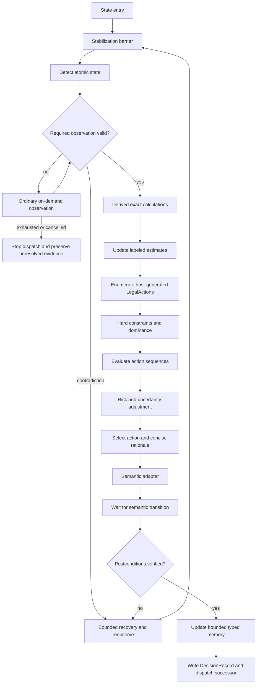
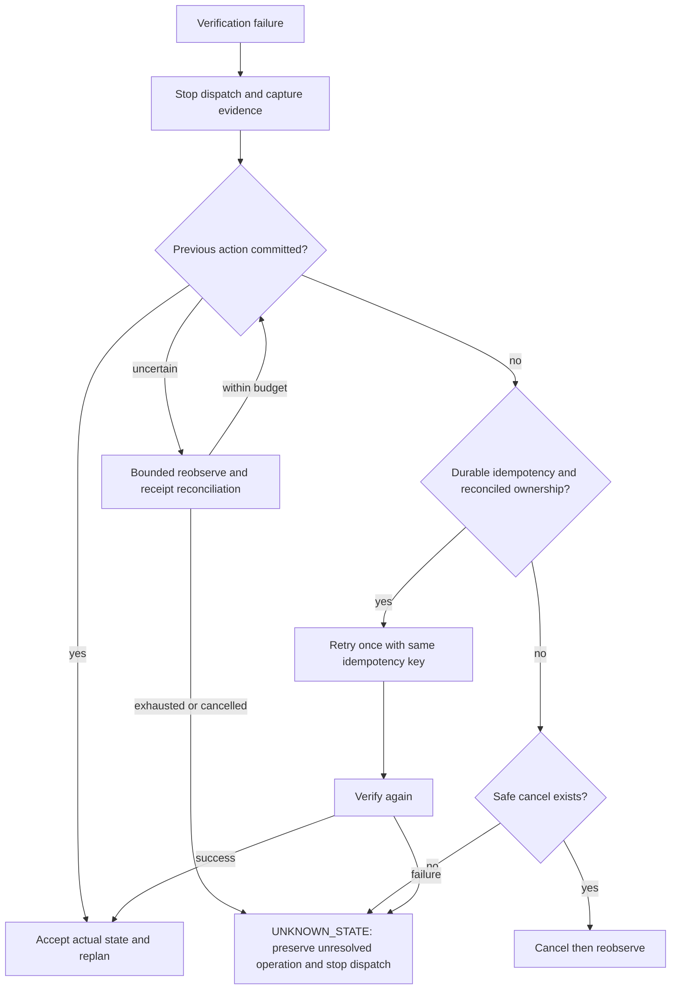

# Slay the Spire 2 expert-state information architecture

## Research status and conclusion

**Research date:** 2026-09-03, America/New_York
**Target:** `sts2-harness` research/specification boundary
**Evidence status:** mixed; source-derived public facts, one confirmed bounded host probe, and
proposed architecture awaiting direct target-build validation

This document updates the proposed information architecture for an autonomous *Slay the Spire 2*
(STS2) harness. It is deliberately self-contained. It does not add a game adapter, a protocol
schema, a simulator, proprietary game bytes, or an assertion that the proposed 144-state inventory
has been observed.

The recommended design is a hybrid semantic bridge:

```text
game-host/mod fair-play shim
  -> access-class firewall
  -> normalized observation
  -> deterministic features + belief estimates + typed bounded memory
  -> planner/search/LLM
  -> host/mod-generated LegalAction selection
  -> semantic execution adapter
  -> transition barrier and independent postcondition verification
```

Computer vision is an independent watchdog/fallback. A reconstructed simulator is a separate
offline process for search, training, parity tests, and counterfactual evaluation. Live hidden RNG
or unrevealed content must never be connected to the production policy.

The branch-local repository has one dated, confirmed `v0.107.1` exact-host trace for a safe overlay
probe. That evidence confirms a narrow coordinator-to-host path and a visible effect witness; it
does not confirm gameplay-rule mutation, every UI state, full semantic extraction, simulator parity,
or an expert-level win rate. See the [bounded host evidence](../evidence/runtime-v1-host-integration-20260902.md).

## Build-control manifest

Public product facts below are `source-derived` from the linked official or aggregation pages. The
local host row is `confirmed` only for the bounded repository trace, not a general compatibility
claim. SteamDB displays times in UTC.

| Field | Research value | Status and source |
| --- | --- | --- |
| Research date/timezone | 2026-09-03 / America-New_York | `confirmed` research pin |
| Steam App ID | `2868840` | `source-derived`; [Steam store](https://store.steampowered.com/app/2868840/Slay_the_Spire_2/) and [SteamDB metadata](https://steamdb.info/app/2868840/info/) |
| Public/main version | `v0.107.1` | `source-derived`; [official patch notes](https://steamcommunity.com/games/2868840/announcements/detail/710026912607505281) and [SteamDB mirror](https://steamdb.info/patchnotes/23811903/) |
| Public/main Steam build | `23811903` | `source-derived`; [SteamDB patch record](https://steamdb.info/patchnotes/23811903/) |
| Public/main date | 2026-06-19 | `source-derived`; [SteamDB patch record](https://steamdb.info/patchnotes/23811903/) |
| Latest located documented beta patch | `v0.111.0` / build `24489008` | `source-derived`; [SteamDB beta patch record](https://steamdb.info/patchnotes/24489008/) |
| Beta patch branch status | not seen in a public branch, according to the patch record | `source-derived`; keep separate from main |
| Current `public-beta` pointer | build `24724944`, version mapping unknown | `source-derived` observation of [SteamDB depot/branch metadata](https://steamdb.info/app/2868840/depots/); re-query before using |
| Exact local host trace | STS2 `v0.107.1`, release commit `59260271`; Windows x86-64 | `confirmed` for the bounded probe; see local host evidence |
| Local host assembly | `sts2.dll` SHA-256 `a1f9e653f1e28e4076558fee1e60d218619cb7e057b887c6417f62c62c6d7a52` | `confirmed` in the retained trace; host bytes were not retained |
| Engine | Godot Engine | `source-derived` SteamDB detected-technology metadata |
| Game logic implementation | C#/.NET DLL is reported by community reverse engineering | `source-derived` precedent only; [Spire Codex](https://github.com/ptrlrd/spire-codex) |
| Characters | Ironclad, Silent, Defect, Necrobinder, Regent | `source-derived`; [Mega Crit announcement](https://www.megacrit.com/news/2026-02-19-release-date-trailer/) |
| Co-op | official mode for up to four players | `source-derived`; [Steam store](https://store.steampowered.com/app/2868840/Slay_the_Spire_2/) |
| Listed platforms | Windows, macOS, Linux/SteamOS | `source-derived`; [Steam store](https://store.steampowered.com/app/2868840/Slay_the_Spire_2/) and [SteamDB metadata](https://steamdb.info/app/2868840/info/) |
| Controller support | full controller support listed by SteamDB | `source-derived`; this is not input-path test evidence |
| Bring-up difficulty | A0 | `proposed` harness experiment setting |
| Regression difficulty | A0 through A10 | `proposed`; must be stratified by character/build |
| Reference capture | 1920x1080, 100% UI scale | `proposed`; direct build validation required |
| Baseline mods/modifiers | no active gameplay mods or run modifiers | `proposed` fair comparison setting |
| Language | en-US | `proposed` capture setting |

### Build separation rule

The live/main manifest and beta manifest are different namespaces. The latest located *documented
beta patch* is `v0.111.0 / 24489008`; it must not be described as the current public-beta branch
head because the separately observed pointer `24724944` has no verified version mapping. A beta
observation never promotes itself into live compatibility.

The v0.107.1 notes state that the game uses a primary run seed and multiple derived PRNG streams,
including streams affecting draws, rewards, events, and other randomness, and that the
implementation changed to `xoshiro256**`. They also state that an integrated mod loader existed
from launch and that Steam Workshop support was added in that patch. These facts support build
pinning and the fair-play boundary; they do not authorize future-outcome reconstruction.

## Ownership and evidence boundary

The research is stored in the harness because the harness owns experiments, typed memory, planning,
decision records, replay/evaluation, ablations, and artifact lineage. The research does not move
the following authorities into the harness:

| Concern | Authority |
| --- | --- |
| Host objects, authoritative game state, state extraction, legal mutations, semantic execution, and UI/actionability bridge | game host and `sts2-game-mod` |
| Host-independent game meaning and deterministic game-domain calculations | `sts2-game-core`, after an owned requirement and test |
| Experiment coordination, estimates, planner/search/LLM, typed memory, `DecisionRecord`, replay, scoring, ablations, and research artifacts | `sts2-harness` |
| MCP framing, tool catalog, and MCP-to-gateway mapping | `sts2-mcp-server` |
| Instance lifecycle, allocation, readiness, routing, leases, fencing, and authorization | `sts2-gateway` |
| Neutral identities, versions, digests, lifecycle metadata, and error-envelope metadata | `sts2-protocol` |

The harness should choose from a host/mod-generated legal-action set. It must not become the
authority that decides whether a card is playable, a target is legal, or a mutation settled.
Game-specific `GameObservation`, `LegalAction`, the 144-state registry, card/enemy rules, and
host compatibility manifests remain proposed interfaces to be implemented by their owning target.

### Evidence hierarchy

Accept claims in this order:

1. reproducible observation on the exact target build;
2. official current-build documentation;
3. build-pinned structured game data with provenance;
4. independently convergent implementation or expert evidence;
5. predecessor STS1 knowledge, only when explicitly labeled as a hypothesis.

Static source inspection, a schema parse, a model response, an acknowledgement, a reachable
process, a successful build, or an accepted action is not proof of game effect, semantic
correctness, replay fidelity, or runtime compatibility.

Each nontrivial field/rule should carry a record like this, using the harness evidence labels:

```json
{
  "field_id": "combat.enemy_intents",
  "source_ids": ["SOURCE-..."],
  "evidence_status": "source-derived",
  "build_id": "live-v0.107.1-build-23811903",
  "observed_at": "2026-09-03T...-04:00",
  "confidence": 0.0,
  "independently_verified": false,
  "validation_required": true
}
```

The production observation serializer must not have a generic `privileged_fields` object. Keep
production fair-play observations and offline evaluator/debugger observations in separate schemas
and processes. CI should fail if any `unsupported`/privileged JSON path is reachable from the
production policy.

The enforceable catalog must be closed, path-based, and transitive. Each field entry names its JSON
pointer, access class, value status, source/reveal surface, source IDs, dependency field IDs,
build/profile digest, observation token, freshness rule, and (when applicable) ordinary reveal event.
Unknown paths are rejected. A privileged dependency taints every derived value that depends on it;
an `exact` calculation is exact only when all dependencies are fresh, build-compatible, legitimate,
and deterministic. Two schemas and two processes help isolation but do not replace allowlists,
negative tests, taint checks, and runtime firewall enforcement.

## Fair-play information classes

Every canonical field gets exactly one primary class.

| Class | Policy | Meaning | Examples |
| --- | --- | --- | --- |
| `VIS_DIRECT` | allow | Current stable UI without a distinct inspection surface | HP, block, energy, hand, displayed costs, enemy HP, visible intent, gold, shop prices |
| `VIS_ON_DEMAND` | allow | Available through an ordinary inspection operation | deck, draw/discard/exhaust contents, map, tooltips, enemy details |
| `OBS_HISTORY` | allow | Reconstructable from previously observed player-visible facts | played cards, pile movement, route history, prior visible enemy moves |
| `DERIVED_EXACT` | allow | Deterministic calculation from legitimate observations | reachability, affordability, valid targets, visible incoming damage, exact current draw combinatorics |
| `ESTIMATED` | allow and label | Probability, heuristic, learned value, or belief | future enemy behavior, expected HP loss, route survival, archetype posterior |
| `PRIVILEGED` | deny | Not ordinarily revealed before the relevant reveal | live RNG state, unrevealed reward roll, hidden map content, unrevealed enemy move |

A seed may be logged as visible text when the player can see it. It may not be used to derive an
unrevealed reward, event, enemy move, or other future outcome. The PRNG notes make this a material
fairness rule, not an implementation detail.

## Proposed atomic state inventory

This is the initial engineering inventory supplied for implementation planning. It contains **144
proposed state IDs** grouped by materially different observation, legal-action, transition, or
recovery semantics. The number is not a direct-build observation. Every row begins with
`validation_status = required` until a pinned discovery campaign produces evidence.

| Family | Proposed stable state IDs |
| --- | --- |
| Application/lifecycle | `APP.BOOT_LOADING`, `APP.TITLE`, `APP.PROFILE_SELECT`, `APP.SAVE_SLOT_SELECT`, `APP.MAIN_MENU`, `RUN.CONTINUE_DETECTED`, `RUN.NEW_SETUP`, `RUN.MODE_SELECT`, `RUN.CHARACTER_SELECT`, `RUN.DIFFICULTY_SELECT`, `RUN.MODIFIER_SELECT`, `RUN.SEED_ENTRY`, `APP.LOADING_TRANSITION`, `RUN.INITIALIZATION`, `RUN.STARTING_BONUS`, `RUN.ACT_VARIANT_SELECT`, `RUN.RESUMED`, `APP.PAUSE_MENU`, `RUN.SAVE_AND_QUIT`, `RUN.ABANDON_CONFIRM`, `RUN.VICTORY`, `RUN.DEFEAT`, `RUN.RESULTS`, `RUN.UNLOCK`, `RUN.PROGRESSION`, `APP.RETURN_MENU_TRANSITION` |
| Co-op setup | `COOP.LOBBY`, `COOP.CHARACTER_SELECT`, `COOP.READY_STATE` |
| Map/navigation | `MAP.FIRST_DISPLAY`, `MAP.ROUTE_INSPECTION`, `MAP.REACHABLE_NODE_SELECT`, `MAP.SCROLLING`, `ROOM.NODE_ARRIVAL`, `MAP.NODE_TRANSITION`, `MAP.ROUTE_BRANCH_DECISION`, `RUN.ACT_TRANSITION`, `MAP.BOSS_PREVIEW_SELECTION`, `MAP.UNAVAILABLE_PATH`, `MAP.EFFECT_MUTATION`, `MAP.AFTER_ROOM_RETURN`, `COOP.MAP_VOTE`, `COOP.ROUTE_COORDINATION` |
| Combat entry/action | `COMBAT.INITIALIZATION`, `COMBAT.PRE_EFFECTS`, `COMBAT.PLAYER_TURN_BEGIN`, `COMBAT.AWAIT_ACTION`, `COMBAT.CARD_SELECTED_NO_TARGET`, `COMBAT.CARD_TARGET_ENEMY`, `COMBAT.CARD_TARGET_CARD`, `COMBAT.CARD_TARGET_PILE` |
| Combat nested choice | `COMBAT.CHOOSE_GENERATED_CARD`, `COMBAT.CHOOSE_DISCARD`, `COMBAT.CHOOSE_EXHAUST`, `COMBAT.CHOOSE_RETAIN`, `COMBAT.CHOOSE_TRANSFORM_MODIFY` |
| Combat inspection | `COMBAT.INSPECT_DRAW`, `COMBAT.INSPECT_DISCARD`, `COMBAT.INSPECT_EXHAUST`, `COMBAT.INSPECT_ENEMY_TOOLTIP`, `COMBAT.INSPECT_PLAYER_EFFECT` |
| Combat potion/end-turn | `COMBAT.POTION_SELECTED`, `COMBAT.POTION_TARGET`, `COMBAT.POTION_DISCARD`, `COMBAT.END_TURN`, `COMBAT.END_TURN_CONFIRM` |
| Combat resolution | `COMBAT.AUTO_EFFECT_RESOLUTION`, `COMBAT.ENEMY_TURN`, `COMBAT.BETWEEN_ENEMIES`, `COMBAT.SUMMON_REINFORCEMENT`, `COMBAT.PHASE_TRANSFORMATION`, `COMBAT.VICTORY_DETECTED`, `COMBAT.POST_VICTORY`, `COMBAT.PLAYER_DEATH`, `COMBAT.INPUT_DISABLED_WAIT`, `COMBAT.FORCED_NOOP` |
| Co-op combat | `COOP.COMBAT_COORDINATION`, `COOP.TARGET_RESOURCE_NEGOTIATION` |
| Rewards | `REWARD.OVERVIEW`, `REWARD.GOLD`, `REWARD.CARD`, `REWARD.CARD_PREVIEW`, `REWARD.CARD_SELECT`, `REWARD.CARD_SKIP`, `REWARD.POTION`, `REWARD.POTION_REPLACE`, `REWARD.POTION_DISCARD_FOR_ROOM`, `REWARD.RELIC`, `TREASURE.CHEST`, `BOSS.REWARD`, `BOSS.RELIC_SELECT`, `REWARD.BUNDLE_SELECT`, `REWARD.CAPSTONE_SELECT`, `COOP.REWARD_DIFFERENCE` |
| Shop | `SHOP.ENTRY`, `SHOP.BROWSE`, `SHOP.CARD_PURCHASE`, `SHOP.RELIC_PURCHASE`, `SHOP.POTION_PURCHASE`, `SHOP.CARD_REMOVE`, `SHOP.SERVICE_PURCHASE`, `SHOP.INSUFFICIENT_GOLD`, `SHOP.SOLD_OUT`, `SHOP.EXIT` |
| Events | `EVENT.ENTRY`, `EVENT.TEXT_INSPECTION`, `EVENT.OPTION_SELECT`, `EVENT.FOLLOWUP_STAGE`, `EVENT.COMBAT_TRANSITION`, `EVENT.REWARD_TRANSITION`, `EVENT.EXIT` |
| Rest/deck manipulation | `REST.ENTRY`, `REST.ACTION_SELECT`, `REST.HEAL`, `REST.UPGRADE`, `REST.REMOVE`, `REST.TRANSFORM`, `REST.RECALL_SPECIAL`, `REST.CHARACTER_SPECIAL`, `SELECT.CARD_UPGRADE`, `SELECT.CARD_REMOVE`, `SELECT.CARD_TRANSFORM`, `SELECT.OBJECT`, `SELECT.CONFIRM`, `SELECT.CANCEL`, `ANCIENT.RELIC_SELECT`, `DIVINATION.CRYSTAL_SPHERE` |
| Exceptional/recovery | `RECOVERY.TUTORIAL_MODAL`, `RECOVERY.SETTINGS_OVERLAY`, `RECOVERY.CONTROLLER_DISCONNECTED`, `RECOVERY.NETWORK_INTERRUPTION`, `RECOVERY.COOP_DESYNC`, `RECOVERY.UNEXPECTED_CONFIRM`, `RECOVERY.TOOLTIP_OBSCURES`, `RECOVERY.UI_SCALE_MISMATCH`, `RECOVERY.STALE_OBSERVATION`, `RECOVERY.FAILED_CLICK`, `RECOVERY.ACTION_DELAYED`, `RECOVERY.STATE_DISAGREEMENT`, `RECOVERY.SAVE_PATCH_INCOMPATIBLE`, `RECOVERY.HIDDEN_MODAL`, `RECOVERY.ILLEGAL_ACTION_REJECTED`, `RECOVERY.DOUBLE_ACTION_SUSPECTED`, `RECOVERY.UNKNOWN_STATE` |

Each row resolves to:

```text
state_id, name, parent_state, build_support, validation_status
entry_predicates[], exit_predicates[], predecessor_states[], successor_states[]
input_enabled, stability, detection_signatures[], confusable_states[]
required_fields[], optional_on_demand_fields[], legal_action_ids[]
transition_timeout_policy, recovery_policy_id
```

Split a proposed state only when observation schema, legal actions/targets, transition semantics,
synchronization, or recovery differs materially. Do not split solely for visual decoration.
Actionability is distinct from visual presence: animation-only and input-disabled windows must not
be treated as policy decision points.

## Semantic action and observation contracts

These are proposed harness-facing shapes, not accepted cross-repository protocol contracts.

### Legal action ontology

The host/mod creates the current legal set; the harness scores or selects within it. Raw coordinates
such as `click(1148, 763)` never cross the policy boundary.

| Action | Parameters | Hard predicate |
| --- | --- | --- |
| `COMBAT.PLAY_CARD` | card instance, optional target | present hand card, current cost affordable, playable, target in valid domain |
| `COMBAT.USE_POTION` | potion slot, optional target | occupied usable slot and valid target |
| `COMBAT.END_TURN` | none | local turn, enabled control, no mandatory selection |
| `COMBAT.SELECT_TARGET` | target ID | pending action and target in current valid-target set |
| `COMBAT.SELECT_CARDS` | card instance IDs | candidates valid and count within current bounds |
| `COMBAT.CONFIRM_SELECTION` | none | selection completion predicate satisfied |
| `MAP.SELECT_NODE` | node ID | node is in current reachable set |
| `COOP.VOTE_NODE` | node ID | vote open and node eligible |
| `REWARD.SELECT_CARD` | reward ID | present and selectable |
| `REWARD.SKIP_CARD` | none | skip control present and enabled |
| `REWARD.REPLACE_POTION` | reward ID, discarded slot | reward pending, inventory full, slot valid |
| `SHOP.BUY` | item ID | unsold, affordable, capacity constraints satisfied |
| `SHOP.REMOVE_CARD` | card instance | service available, affordable, card eligible |
| `EVENT.SELECT_OPTION` | option ID | visible option enabled and visible requirements satisfied |
| `REST.SELECT_OPTION` | option ID | shown and enabled |
| `SELECT.CHOOSE` | semantic candidate | candidate in current selection domain |
| `SELECT.CONFIRM` | none | selection rule satisfied |
| `UI.CANCEL` | none | cancellation is exposed and safe |
| `SYS.WAIT` | bounded timeout | state is transient or input disabled |
| `SYS.REOBSERVE` | none | always legal to the harness |
| `RECOVERY.RESYNC` | none | stale/disagreement/desync recovery is active |
| `RUN.SAVE_QUIT` | none | safe single-player save-and-quit is exposed |

### `GameObservation`

```json
{
  "schema_version": "string",
  "build_id": "string",
  "timestamp": "RFC3339",
  "state_id": "COMBAT.AWAIT_ACTION",
  "transition_id": "string",
  "visible_fields": {},
  "on_demand_fields": {},
  "historical_fields": {},
  "derived_fields": {},
  "estimates": {},
  "unavailable_fields": [],
  "confidence": {},
  "source_metadata": {},
  "stale_flags": {}
}
```

Minimum combat fields include character/resources/HP/block, hand instance IDs and effective costs,
playability reasons, legitimate pile contents/order constraints, stable enemy IDs and visible HP,
block, phase, effects, intents, targets, hit counts, player effects, relic counters, potions,
turn history, visibly committed effects, and pending selections. Exact calculations include legal
targets, affordability, visible incoming damage, survival margins, guaranteed lethal witnesses,
overkill, reshuffle boundaries, and finite-multiset draw probabilities. Future enemy behavior,
unknown draw order, future HP loss, potion opportunity cost, and future-fight value remain estimates.

The production envelope also needs the harness identity context: `instance_id`, `session_id`,
lease/epoch or equivalent fence, run/episode/trajectory IDs, actor scope, monotonic observation
sequence, snapshot token, collection generations, schema/profile/catalog digests, and freshness
metadata. These identities must remain distinct from a semantic action ID, proposal ID, operation
ID, and boundary-local idempotency key.

### `DecisionRecord`, `StateTransition`, and `PatchManifest`

```json
{
  "observation_hash": "...",
  "objective": {},
  "legal_candidates": [],
  "hard_eliminations": [],
  "calculations": {},
  "estimates": {},
  "candidate_scores": {},
  "selected_action": {},
  "concise_rationale": "named visible facts and calculations only",
  "uncertainty": {},
  "expected_transition": {},
  "actual_transition": {},
  "outcome": {},
  "policy_model_version": "..."
}
```

```json
{
  "source_state": "COMBAT.AWAIT_ACTION",
  "action": {},
  "expected_target_states": [],
  "actual_target_state": null,
  "latency_ms": 0,
  "success_evidence": [],
  "failure_evidence": [],
  "recovery_action": null
}
```

```json
{
  "build_identifier": "live-v0.107.1-build-23811903",
  "data_hash": null,
  "ui_signatures": {},
  "changed_entities": [],
  "changed_schemas": [],
  "affected_tests": [],
  "migration_status": "validated|quarantined|blocked"
}
```

The patch manifest should also record branch/channel, depot/manifest identifiers, all authorized
host and project artifact hashes, loader/ABI/runtime compatibility, UI/accessibility signatures,
access classes, state detectors, legal predicates, effect witnesses, RNG policy, simulator parity,
schema/profile digests, migration, rollback, and quarantine decisions. A nullable data hash alone is
not enough to describe Early Access drift.

Action lifecycle is explicit and cross-boundary:

```text
proposed -> admitted -> dispatched -> accepted -> settling -> settled
                                      |-> rejected
                                      |-> cancelled
                                      |-> unknown -> reconciled
```

Timeout or disconnect preserves the original operation identity. A retry is permitted only when
the downstream owner supplies durable idempotency and the policy has reconciled ownership; an
uncertain irreversible mutation must not be replaced by a new strategic action.

## Decision policy

Every state policy follows the same auditable loop:



Stabilization, on-demand observation, and recovery share a monotonic deadline and finite attempt
budget for the current decision; re-entry must not reset either bound. Cancellation or exhaustion
stops dispatch and preserves unresolved evidence instead of treating missing fields as valid.

### Combat

Use this ordering: guaranteed lethal check; visible survival constraint; forced/state-specific
mechanics; target priority; sequence search; resource preservation; setup/scaling value. Search
sequences, not isolated card scores. A search node contains a fair-observation hash, exact mutable
combat state, remaining legal actions/resources, pending effects, sequence, deterministic utility,
belief state, and risk budget.

Hard prune illegal actions and strict dominance under identical future state. Do not prune because a
card has low generic value. Compare `REWARD.SKIP_CARD` and all other skip choices as first-class
actions. Preserve typed facts such as incoming visible damage, current HP/block, pile constraints,
relic counters, enemy multi-hit intent, potion slot value, and phase/summon consequences.

### Map, rewards, shops, events, and rests

Treat route choice as a distribution, not a node-type preference:

```text
U(route) = expected rewards - HP-risk penalty + flexibility + information value - tail risk
```

Store route nodes, expected HP-loss distribution, survival probability, boss-readiness probability,
variance, downside tail, future flexibility, gold/potion effects, assumptions, and uncertainty.
Reachability is exact; future content, elite readiness, expected loss, and reward value are estimates.

For card rewards compare every card with skip using marginal value:
`DeltaV(card) = V(deck + card) - V(deck)`, decomposed into encounter coverage, scaling, energy,
draw consistency, dilution, upgrade burden, synergy, anti-synergy, and speculation.

For shops enumerate feasible ordered bundles, including reserve-all-gold. Evaluate immediate
survival, deck improvement, potion-slot pressure, next critical encounter, remaining/future gold,
future-shop likelihood, and reserve value.

For events record stage and typed effects: HP/max-HP, gold, card mutation, relic/potion, route/map,
combat/reward transition, delayed flags, and outcome distributions. Never turn an unrevealed outcome
into a fact. At rests compare incremental run survival/value of healing with the best alternative,
including reachable encounters, potion buffer, upgrade delta, deck consistency, special options,
progression constraints, and risk tolerance.

## Synchronization and recovery

Do not use a global sleep after every input. A proposed actionable predicate is:

```text
Actionable(t) = KnownState
  AND InputEnabled
  AND NOT BlockingModal
  AND RequiredFieldsFresh
  AND SnapshotStableFor(build-specific threshold)
```

Before dispatch, recheck the observation transition ID, state, input enabled flag, current legal
set, instance IDs, resource/cost predicate, and target validity. After dispatch, wait for an expected
successor or semantic same-state mutation, then verify resource consumption, collection changes,
modal changes, absence of an unexpected top modal, and stable state before replanning.

On verification failure, stop strategic dispatch, capture bridge/CV/history snapshots, and classify:



Commit and non-commit conclusions require operation-bound authoritative evidence, not merely a
stable observation or changed generation. Recovery uses the original operation identity and a
shared monotonic deadline/finite attempt budget; exhausting it is not proof of non-commit. Preserve
the unresolved operation and its evidence, suspend strategic dispatch, and require explicit
reconciliation before resuming. Reversibility alone never grants retry: compensation or cancellation
must be separately admitted by the host as safe and must not erase an uncertain original outcome.

Dedicated recovery cases include stale observations, hidden modals, wrong target IDs, detector
disagreement, delayed animation, double dispatch, network interruption, co-op desync, save/patch
incompatibility, UI-scale drift, illegal-action rejection, and novel state. Unknown state must fail
closed.

## Co-op extension

Co-op adds fields rather than overloading single-player fields:

```text
players[]: player_id, character_id, public HP/resources, readiness, public status
local_player_id, host_role, network_state, public_votes, valid_ally_targets
pending_team_choice, coordination_record
```

Keep private/local action, shared vote, shared resource effect, ally-targeted action,
synchronization wait, and coordination recommendation distinct. Ally targets use stable semantic
`player_id`, never screen position. A peer disagreement suspends autonomous gameplay until sync is
restored.

## Importance and evaluation protocol

Initial importance labels are engineering priors, not completed ablation results.

| Priority | Candidate information |
| --- | --- |
| Critical | atomic state, actionability/modal state, HP/resources, hand/costs/playability, targets, enemy HP/effects/intent, legal set, exact survival/lethal, reachability, reward/skip, gold/prices, event/rest/selection domains |
| High | piles, deck, relics/counters, potions, draw probabilities, route graph, build functions, readiness, HP/potion/gold budgets, upgrade/removal priorities |
| Situational | order constraints, overkill-specific value, specialized synergy posteriors, compressed combat-history aggregates |
| Prohibited | every `PRIVILEGED` field, regardless of predictive value |

For each field or coherent group compare full legitimate observation against `remove`, `mask`,
`delay`, `stale`, `noise/corrupt`, and confidence-degraded conditions. Pair seeds only for variance
control; never use a seed to reveal hidden outcomes.

Measure action agreement, tactical/route regret, damage taken, resource consumption, illegal-action
rate, stale-action rate, transition verification, recovery by failure type, calibration, encounter
survival, act/run completion, and character/difficulty/build slices. Privileged leak rate, stale
action rate, double-action rate, and unsafe unknown-state continuation must be zero for production.

AgenticSTS is a methodology precedent: its paper reports a bounded typed-memory testbed, 298
completed trajectories, and a fixed-A0 directional comparison of 3/10 versus 6/10 when triggered
skills are enabled; it also reports Fisher exact p approximately 0.37. This is evidence for an
ablation design, not proof that any single field here is critical.

## Patch drift and prioritized backlog

Every build change enters quarantine:

```text
new build ID
 -> freeze old manifest and traces
 -> hash local executable/DLL/PCK when authorized
 -> diff structured data, state signatures, and legal predicates
 -> regenerate fixtures
 -> rerun UI/CV, simulator parity, leak, smoke, and co-op suites
 -> expert review of material rules
 -> validated promotion or blocked/quarantined manifest
```

| Phase | Deliverable | Release gate |
| --- | --- | --- |
| 0 | exact build/branch/depot manifest, hashes, profile/settings, capture record | reinstall/re-hash reproduces bytes; live/beta isolated |
| 1 | state registry, detector ensemble, transition logger, unknown sink | per-atomic-state confusion matrix and transient/modal coverage |
| 2 | fair bridge, access catalog, normalizer, history/freshness engine | field exact-match and production privilege-path scan = zero leaks |
| 3 | host-generated legal set, semantic adapter, barriers, postcondition verifier | no raw policy UI action; zero known illegal/double actions |
| 4 | deterministic combat calculators and sequence search | controlled target-build golden fixtures match |
| 5 | typed bounded memory, route/build/shop/event/rest planning | expert review and stale-memory invalidation |
| 6 | isolated simulator adapter and parity harness | differential mechanic fixtures and RNG isolation pass |
| 7 | consented expert traces and imitation baseline | stratified agreement and disagreement records |
| 8 | search/RL optimization with masked legal actions | supported gain without legality/fairness regression |
| 9 | co-op players/votes/ally targets/sync model | two-to-four-instance disconnect/desync suite |
| 10 | patch manifests, canaries, rollback, monitoring | every new build quarantined until validated |

## Open validation gates

The following remain `unverified` or `required`, even though public precedent makes them plausible:

- exact executable/PCK/DLL hashes for the research pin beyond the retained host assembly record;
- direct observation of every proposed state on public/main `v0.107.1`;
- live-versus-beta state/action deltas, including the `24724944` pointer mapping;
- pixel/UI signatures across resolution, scale, controller, and accessibility settings;
- field-level importance, expert-panel agreement, full-run traces, and independent replication;
- simulator parity by mechanic and build;
- native-rendered state diagrams/PNGs and genuine target-build trace artifacts;
- a final state count after evidence-based splits/merges.

Do not fill these gaps with STS1 assumptions. The existing host probe and external projects establish
implementation precedent or bounded runtime evidence only.

## Source ledger

For a retained snapshot, each source record should add `source_id`, title, publisher/author, URL or
snapshot identifier, retrieval timestamp, content hash, exact locator, claimed build, license or
redistribution status, independence, contradictions, and permitted use (`fact`, `feasibility`, or
`hypothesis`). The live links below are citations for this document, not retained game files or a
claim of immutable snapshot storage.

| Source | Role in this document | Evidence treatment |
| --- | --- | --- |
| [Steam store](https://store.steampowered.com/app/2868840/Slay_the_Spire_2/) | App identity, Early Access, listed platforms, single-player/co-op, four-player copy, evolving content | official; `source-derived` |
| [Mega Crit release announcement](https://www.megacrit.com/news/2026-02-19-release-date-trailer/) | five character names and official co-op description | official; `source-derived` |
| [v0.107.1 official announcement](https://steamcommunity.com/games/2868840/announcements/detail/710026912607505281) | PRNG streams/change, mod loader, Workshop | official; `source-derived` |
| [v0.107.1 SteamDB record](https://steamdb.info/patchnotes/23811903/) | build/date mirror and readable patch record | aggregation; corroborating `source-derived` |
| [v0.111.0 SteamDB record](https://steamdb.info/patchnotes/24489008/) | separate documented beta patch and branch note | aggregation; `source-derived` |
| [SteamDB app metadata](https://steamdb.info/app/2868840/info/) and [depot/branch metadata](https://steamdb.info/app/2868840/depots/) | App ID, listed systems/controller, Godot detection, and branch/build pointers | aggregation; `source-derived` |
| [Godot InputMap](https://docs.godotengine.org/en/stable/classes/class_inputmap.html) and [Input](https://docs.godotengine.org/en/stable/classes/class_input.html) | semantic input/action architecture rationale | official engine capability; not STS2 API proof |
| [Spire Codex](https://github.com/ptrlrd/spire-codex) | community PCK/DLL extraction and structured game-data precedent | community; not authority or parity proof |
| [CharTyr STS2-Agent](https://github.com/CharTyr/STS2-Agent), [v0.9.2](https://github.com/CharTyr/STS2-Agent/releases/tag/v0.9.2), [v0.8.1](https://github.com/CharTyr/STS2-Agent/releases/tag/v0.8.1) | semantic API/MCP, state/action, multiplayer, and live-test precedent | community claims; not official or fair-play proof |
| [STS2 RL Agent](https://github.com/zhiyue/sts2-rl-agent) | headless simulator, C# bridge, and invalid-action masking precedent | community claims; parity requires independent tests |
| [AgenticSTS paper](https://arxiv.org/abs/2607.02255) and [repository](https://github.com/AlayaLab/AgenticSTS) | bounded typed memory and ablation methodology | research precedent; directional results only |

## Production invariant

```text
no decision without a stable state
AND no action outside host-generated LegalAction
AND no continuation without verified transition
AND no production access to PRIVILEGED information
```
